# Emm_V5.0 步进闭环驱动说明书 Rev1.3

> 原作者：张大头智控（张大头闭环伺服）  
> 原文地址：<https://blog.csdn.net/zhangdatou666/article/details/132644047>  
> 原文首次发布：2023-09-03；原页面显示最后修改：2025-03-01  
> 离线整理：2026-07-24  
> 许可协议：CC BY-SA 4.0。本离线版保留原作者、原文链接和许可证声明；正文按原文章节结构整理，图片已下载到本地，移除了广告、评论及站内推荐。

> [!warning] 安全提示
> - 禁止带电插拔电机、电源线和通讯模块。
> - 首次使用或磁铁、驱动板相对位置改变后，应恢复出厂设置并重新进行编码器校准。
> - 编码器校准尽量在电机空载或轻载状态下进行。
> - 电机两组绕组必须分别正确接入 `A+/A-` 与 `B+/B-`。

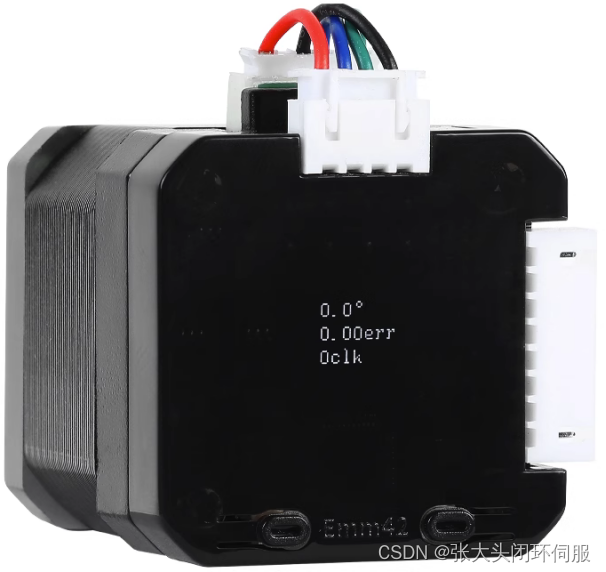

## 一、产品介绍

### 1.1 产品简介

Emm42_V5.0 是基于 Emm42_V4.2 升级的 42 步进闭环驱动方案，融合 ZDT_X42_V1.2 的软硬件框架。它升级了闭环算法，支持更高转速、更快运动速度、堵转电流限制，以及串口、RS232、RS485、CAN 和脉冲控制。

典型应用包括 3D 打印机、写字机、雕刻机、PLC 控制、机械臂和竞赛车辆等。

### 1.2 硬件介绍

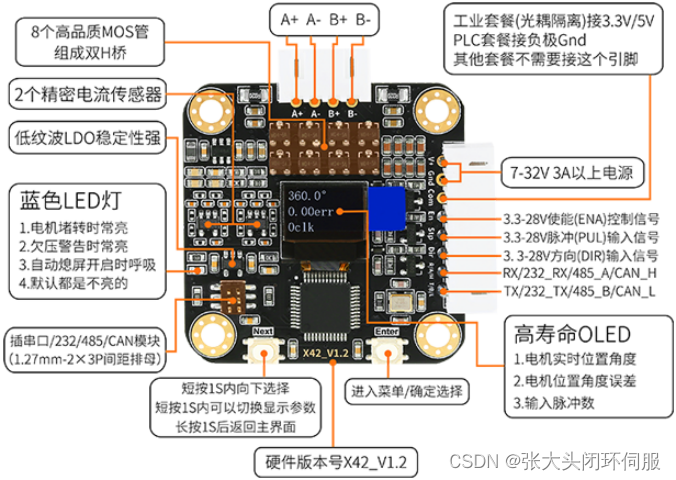

### 1.3 套餐与接口形式

#### Emm42_V5.0 与上一代外观

| Emm42_V5.0 | Emm42_V4.2 |
|---|---|
| 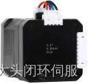 | 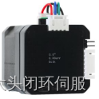 |

#### PLC 脉冲套餐

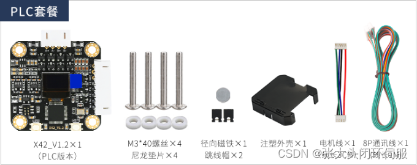

#### 工业脉冲套餐

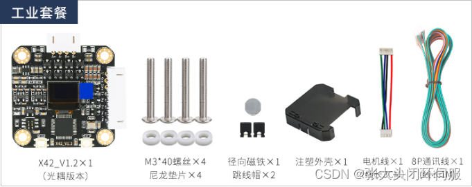

#### RS485 套餐

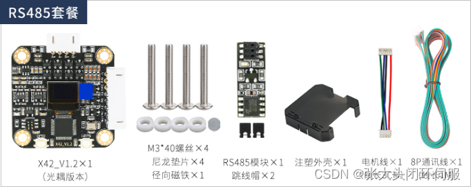

#### RS232 套餐

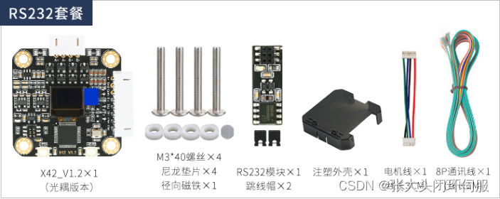

#### CAN 套餐

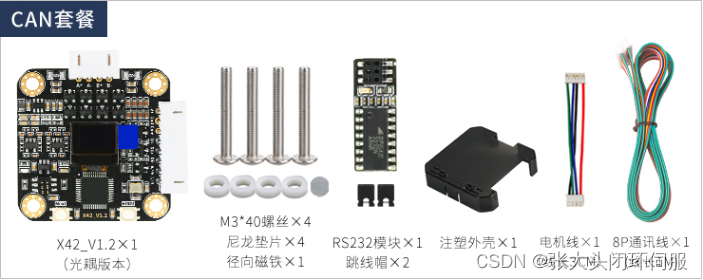

### 1.4 产品参数

| 项目 | 参数 |
|---|---|
| 主板型号 | Emm42_V5.0 |
| 主控芯片 | 高性能 32 位 ARM 处理器 |
| 驱动电路 | 8 个 MOS 管组成双 H 桥驱动 |
| 传感器 | 16384 线磁编码器、精密电流传感器 |
| 供电电压 | 7–32 V；实际使用建议按原文故障说明采用 12–32 V |
| 工作电流 | 0–3000 mA 可配置 |
| 信号输入 | 3.3–28 V；支持共阳、共阴以及 PLC NPN/PNP 24 V 信号 |
| 闭环反馈频率 | 力矩环、速度环、位置环均为 20 kHz 以上 |
| 最大脉冲频率 | 160 kHz 以上 |
| 最高转速 | 0.1–3000 RPM 以上，实际取决于电机参数与负载 |
| 控制精度 | 小于 0.08° |
| 细分 | 1–256 任意细分，支持细分插补 |
| 控制方式 | 脉冲、UART、RS232、RS485、CAN，多机同步 |
| 通讯运动模式 | 速度模式、位置模式、曲线加减速、立即停止 |
| 保护 | 堵转保护、欠压警告、电流限制 |
| 回零 | 单圈就近、单圈方向、多圈无限位碰撞、多圈有限位开关回零 |
| 到位输出 | 通讯到位返回、脉冲接口到位输出 |

### 1.5 机械尺寸

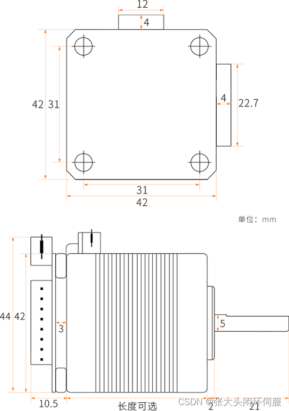

## 二、闭环 PCBA 安装

### 2.1 硬件清单

| 序号 | 品名 | 数量 |
|---:|---|---:|
| 1 | 42 步进电机 | 1 |
| 2 | ZDT_X42_V1.2 闭环 PCBA | 1 |
| 3 | M3×7 mm 螺丝 | 4 |
| 4 | 5×3 mm 径向磁铁 | 1 |
| 5 | 尼龙垫片 | 4 |
| 6 | 3M 胶、超能胶或 AB 胶 | 1 |
| 7 | 螺丝刀 | 1 |
| 8 | 通讯线 | 1 |

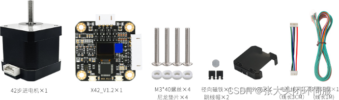

> [!note]
> 胶水应选择有一定黏稠度、对金属和磁铁附着力较强的产品。避免使用容易渗入电机内部的低黏度胶水。

### 2.2 安装步骤

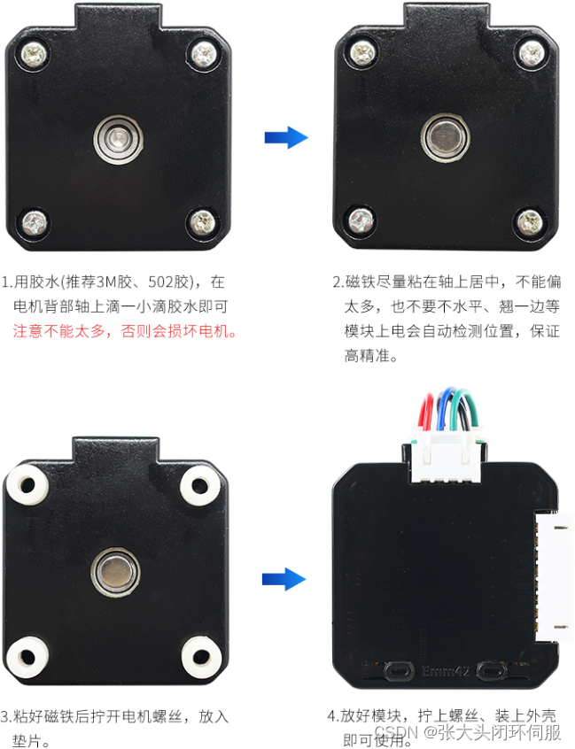

安装时重点保证：

1. 径向磁铁牢固安装在电机轴中心。
2. 磁铁与磁编码器位置同心，间隙适当。
3. 尼龙垫片与螺丝安装牢靠，避免 PCB 受力变形。
4. 电机绕组线序正确，安装完成后再上电校准。

## 三、第一次上电校准

### 3.1 模块供电接线

在 `V+` 与 `GND` 之间接入直流电源。

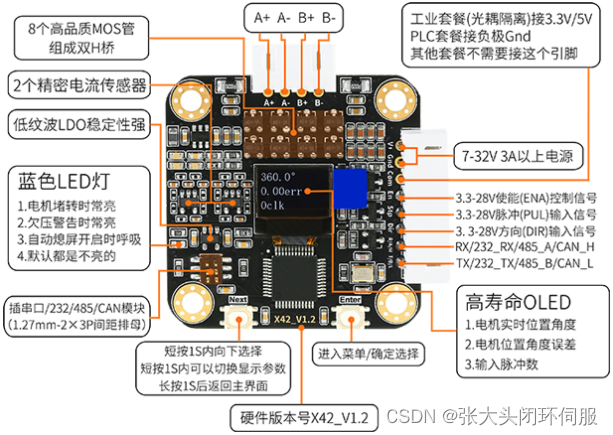

### 3.2 上电自检提示

| 屏幕提示 | 含义 | 处理方法 |
|---|---|---|
| `Not Cal` | 编码器尚未校准 | 进入 `Cal` 菜单完成校准 |
| `Phase A+ A- Error!` | A 相线序错误 | 检查 A 相两根绕组线 |
| `Phase B+ B- Error!` | B 相线序错误 | 检查 B 相两根绕组线 |
| `Phase AA BB Error!` | 两组绕组划分或线序错误 | 用万用表蜂鸣档确认两组绕组 |
| `Waiting V+ Power` | 电源电压不足或未正确接入 | 检查 `V+`、`GND` 与供电电压 |

常见 42 步进电机中，两根互相导通的线属于同一组绕组。两组绕组分别接入 `A+/A-` 与 `B+/B-`，同组内部正负接反只会改变方向，不应把不同绕组的线混接成一组。

### 3.3 按键与参数显示

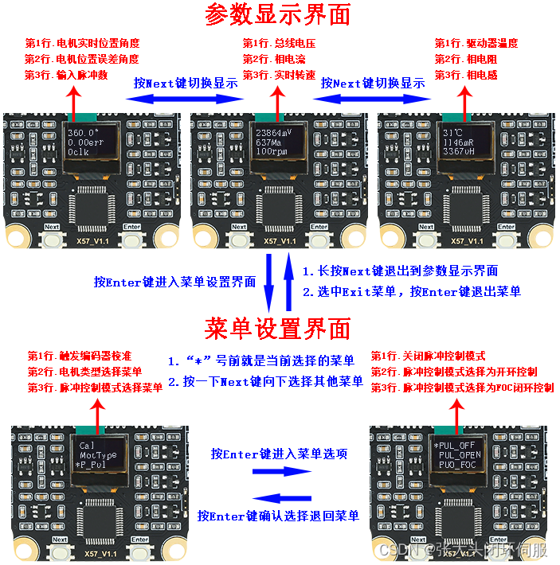

### 3.4 编码器校准

未校准时通常只显示 `Cal`、`MotType`、`P_Pul`、`P_Serial`、`Restore`、`Exit` 等基础菜单。

校准步骤：

1. 根据电机选择 `MotType`：`0.9°` 或 `1.8°`。
2. 选择 `Cal` 并确认。
3. 电机会先缓慢正转一圈，再缓慢反转一圈。
4. 校准期间系统会测量磁铁偏心并进行线性修正，同时辨识电机相电阻和相电感。
5. 校准完成后重新检查菜单与运行状态。

驱动板从电机上拆下、磁铁重新粘贴或两者相对位置发生变化后，应执行 `Restore`，断电重启并重新校准。

## 四、OLED 菜单

### 4.1 控制与基础参数

| 菜单 | 选项/范围 | 作用 |
|---|---|---|
| `Cal` | — | 编码器线性化与电角度对齐 |
| `MotType` | `0.9°`、`1.8°` | 设置步进电机基本步距角 |
| `P_Pul` | `PUL_OFF`、`PUL_OPEN`、`PUL_FOC`、`ESI_RCO` | 选择脉冲端口功能；默认闭环为 `PUL_FOC` |
| `P_Serial` | `RxTx_OFF`、`ESI_ALO`、`UART_FUN`、`CAN1_MAP` | 选择通讯端口复用功能 |
| `En` | `L`、`H`、`Hold` | 设置使能端口有效电平；`Hold` 表示始终使能 |
| `Dir` | `CW`、`CCW` | 设置脉冲控制正方向 |
| `MStep` | 1、2、4、8、16、32、64、128、256 | 设置外部脉冲细分，需与控制器一致 |
| `MPlyer` | `Disable`、`Enable` | 启用内部细分插补，降低低速振动和噪声 |
| `AutoSDD` | `Disable`、`Enable` | 无按键约 7 秒后自动熄屏 |

`P_Pul` 模式说明：

- `PUL_OFF`：关闭脉冲输入。
- `PUL_OPEN`：开环模式，不依赖编码器，最高转速通常较低。
- `PUL_FOC`：FOC 矢量闭环模式，电流实时调节。
- `ESI_RCO`：脉冲端口复用为限位输入和到位输出。

`P_Serial` 模式说明：

- `RxTx_OFF`：关闭通讯端口。
- `ESI_ALO`：`R/A/H` 作为限位输入，`T/B/L` 作为报警输出。
- `UART_FUN`：UART、RS232 或 RS485 通讯。
- `CAN1_MAP`：CAN 通讯。

### 4.2 电流与输出限制

| 菜单 | 选项/范围 | 作用 |
|---|---|---|
| `Ma` | 200–3000 mA；通讯可设 0–3000 mA | 开环工作相电流，默认约 1000 mA |
| `Ma_Limit` | 200–3000 mA | FOC 闭环堵转时最大相电流，默认约 3000 mA |
| `Op_Limit` | 200–5000 mV 档位 | 限制 FOC 最大输出电压，从而近似限制转速与电流 |

### 4.3 通讯参数

| 菜单 | 选项/范围 | 作用 |
|---|---|---|
| `UartBaud` | 9600、19200、25000、38400、57600、115200、256000、512000、921600 | UART/RS232/RS485 波特率，默认 115200 |
| `CAN_Baud` | 10k、20k、50k、83.333k、100k、125k、250k、500k、800k、1M | CAN 波特率，默认 500 kbit/s |
| `ID_Addr` | 1–16；通讯命令可设置 1–255 | 从机地址；0 为广播地址 |
| `Checksum` | `0x6B`、`XOR`、`CRC-8`、`Modbus` | 通讯校验方式，默认固定 `0x6B` |
| `Response` | `None`、`Receive`、`Reached`、`Both`、`Other` | 控制命令确认和位置到位返回策略 |
| `S_Vel_IS` | `Disable`、`Enable` | 启用后输入速度缩小 10 倍，可表达 0.1 RPM |

`Response`：

- `None`：不返回收到确认，也不返回到位帧。
- `Receive`：只返回收到确认，默认值。
- `Reached`：位置模式到位后返回 `地址 FD 9F 校验`。
- `Both`：返回收到确认，也返回位置到位帧。
- `Other`：位置模式只返回到位帧，其他动作返回收到确认。

### 4.4 堵转保护

| 菜单 | 作用 |
|---|---|
| `Clog_Pro` | 启用/关闭堵转后自动关闭驱动输出 |
| `Clog_Rpm` | 堵转检测转速阈值 |
| `Clog_Ma` | 堵转检测相电流阈值 |
| `Clog_Ms` | 堵转检测持续时间阈值 |

堵转判定需同时满足：

- 实际转速小于 `Clog_Rpm`；
- 实际相电流大于 `Clog_Ma`；
- 持续时间大于 `Clog_Ms`。

触发堵转保护后，可发送解除堵转命令，或在 `P_Serial=ESI_ALO` 时将 `R/A/H` 拉低复位。

### 4.5 回零参数

| 菜单 | 作用 |
|---|---|
| `O_Mode` | `Nearest` 单圈就近、`Dir` 单圈方向、`Senless` 多圈碰撞、`EndStop` 多圈限位回零 |
| `O_Dir` | 回零方向：`CW` / `CCW` |
| `O_Vel` | 回零速度，常用范围 30–300 RPM |
| `O_Tmo_Ms` | 回零超时时间，超时后置位失败标志 |
| `O_Set` | 设置或清除单圈回零零点 |
| `O_SL_Rpm` | 碰撞回零检测转速阈值 |
| `O_SL_Ma` | 碰撞回零检测电流阈值 |
| `O_SL_Ms` | 碰撞回零检测持续时间阈值 |
| `O_POT_En` | 上电自动触发回零 |
| `Restore` | 恢复出厂设置；断电重启后需重新校准 |

## 五、脉冲控制

### 5.1 接线

#### 3.3 V 共阳接法

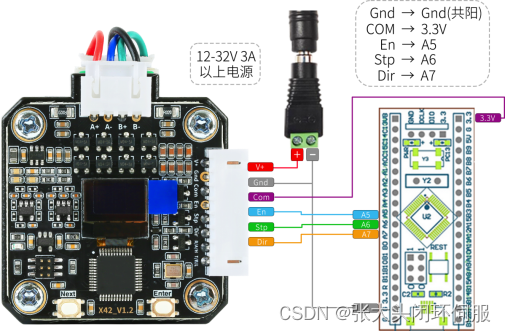

#### 3.3 V 共阴接法

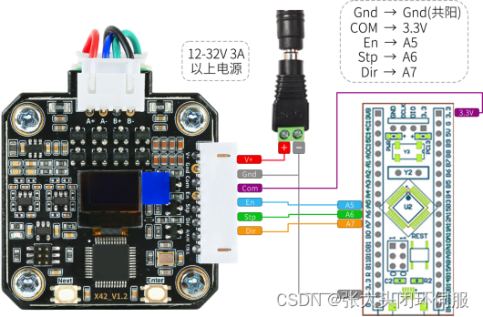

#### STC/单片机接线

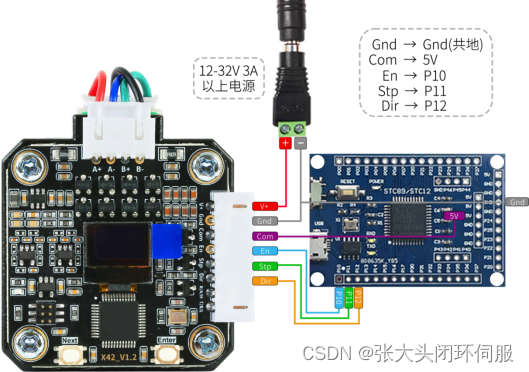

#### PLC 接线

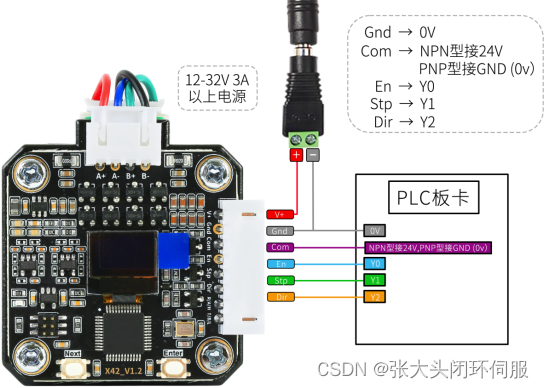

#### 差分脉冲接线

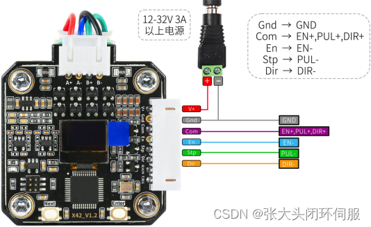

#### 3D 打印主板转接

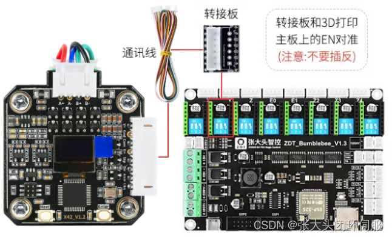

### 5.2 脉冲控制原理


一个完整脉冲通常由一次低、高电平变化构成。控制器向 `Stp/PUL` 端发送脉冲：

- 脉冲数量决定转角；
- `Dir` 电平决定方向；
- 脉冲频率决定速度；
- `En` 根据菜单设定决定使能状态。

以 1.8° 步进电机为例：

- 16 细分：每圈 `200 × 16 = 3200` 个脉冲；
- 32 细分：每圈 `200 × 32 = 6400` 个脉冲。

一般关系：

```text
每圈脉冲数 = 360° / 基本步距角 × 细分数
目标脉冲数 = 目标角度 / 360° × 每圈脉冲数
```

## 六、通讯控制

### 6.1 接线

#### UART 单机与多机

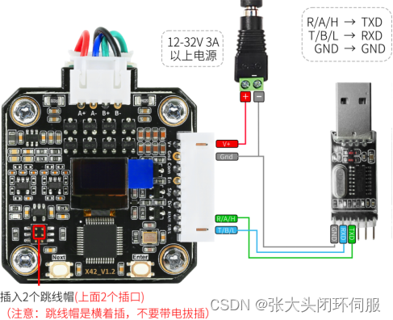

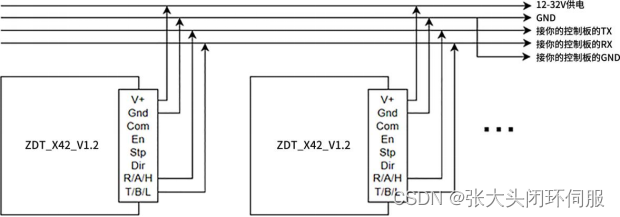

#### RS232 单机与多机

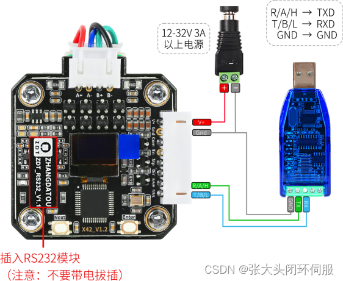

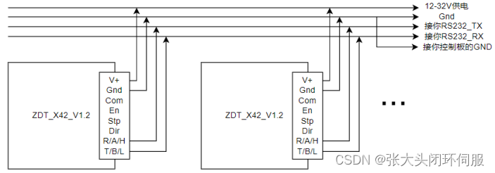

#### RS485 单机与多机

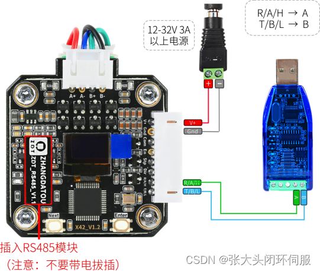

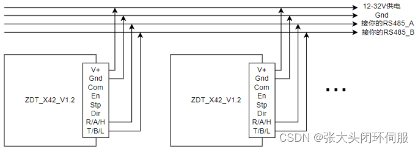

#### CAN 单机与多机

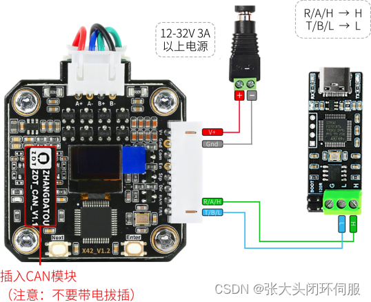

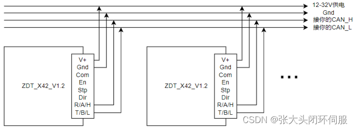

### 6.2 调试工具

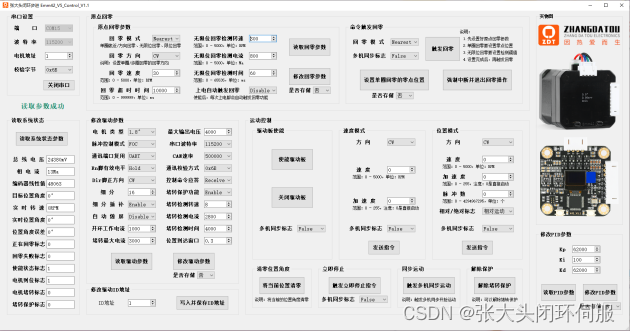

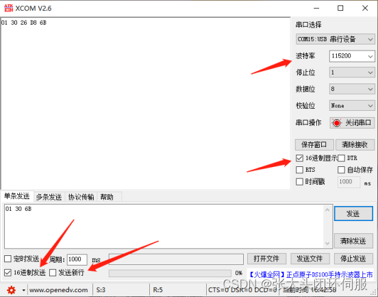

### 6.3 通讯帧格式

```text
地址 + 功能码 + 指令数据 + 校验字节
ID_Addr + Func_Code + Data + CheckSum
```

- 默认地址为 `0x01`，范围 `1–255`。
- 地址 `0x00` 为广播地址；广播执行时通常仅地址 1 的设备回复。
- 默认校验字节固定为 `0x6B`，也可配置 XOR、CRC-8 或 Modbus。
- 多字节数值按协议示例排列，编程前应核对字节长度、符号位和大小端。

### 6.4 返回状态

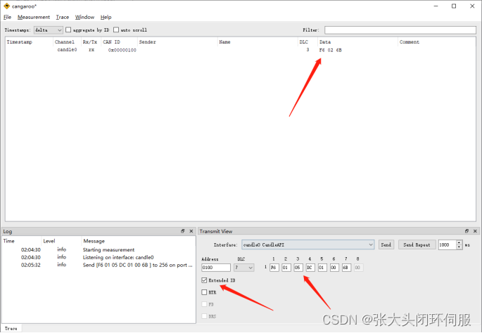

常见返回：

| 返回数据 | 含义 |
|---|---|
| `地址 功能码 02 校验` | 命令执行成功 |
| `地址 功能码 E2 校验` | 条件不满足，例如未使能或已触发堵转保护 |
| `地址 00 EE 校验` | 命令格式或参数错误 |
| `地址 FD 9F 校验` | 位置模式到位通知 |

### 6.5 控制动作命令

以下示例均以地址 `01`、固定校验 `6B` 为例。

#### 电机使能 `F3`

```text
格式：地址 F3 AB 使能状态 多机同步标志 校验
使能：01 F3 AB 01 00 6B
失能：01 F3 AB 00 00 6B
```

#### 速度模式 `F6`

```text
格式：地址 F6 方向 速度(2B) 加速度 多机同步标志 校验
示例：01 F6 01 05 DC 0A 00 6B
```

示例含义：方向 `CCW`，速度 `0x05DC = 1500 RPM`，加速度档位 10，不启用同步。

加速度档位为 0 时不使用曲线加减速。原文给出的相邻速度步进时间关系为：

```text
t2 - t1 = (256 - acc) × 50 μs
Vt2 = Vt1 + 1 RPM
```

#### 位置模式 `FD`

```text
格式：地址 FD 方向 速度(2B) 加速度 脉冲数(4B) 相对/绝对 同步标志 校验
示例：01 FD 01 05 DC 00 00 00 7D 00 00 00 6B
```

示例含义：`CCW`、1500 RPM、无曲线加速、32000 个脉冲、相对位置模式、不启用同步。

#### 立即停止 `FE`

```text
格式：地址 FE 98 多机同步标志 校验
示例：01 FE 98 00 6B
```

适用于速度模式和位置模式，执行紧急制动。

#### 多机同步触发 `FF 66`

```text
格式：地址 FF 66 校验
示例：01 FF 66 6B
```

多机同步流程：先分别向各电机发送带“同步标志”的运动命令，使其进入等待状态，再发送同步触发命令。

### 6.6 回零命令

#### 设置单圈回零零点 `93 88`

```text
格式：地址 93 88 是否存储 校验
示例：01 93 88 01 6B
```

将电机转到所需零点后发送该命令。

#### 触发回零 `9A`

```text
格式：地址 9A 回零模式 多机同步标志 校验
示例：01 9A 00 00 6B
```

#### 修改回零参数 `4C AE`

```text
格式：地址 4C AE 是否存储 回零参数 校验
示例：01 4C AE 01 00 00 00 1E 00 00 27 10 01 2C 03 20 00 3C 00 6B
```

该示例表示：

- 保存参数；
- `Nearest` 单圈就近回零；
- `CW`；
- 回零速度 30 RPM；
- 超时 10000 ms；
- 碰撞检测转速 300 RPM；
- 碰撞检测电流 800 mA；
- 碰撞检测时间 60 ms；
- 不启用上电自动回零。

#### 读取回零状态 `3B`

```text
格式：地址 3B 校验
示例：01 3B 6B
```

回零状态位：

| 位掩码 | 状态 |
|---:|---|
| `0x01` | 编码器就绪 |
| `0x02` | 校准表就绪 |
| `0x04` | 正在回零 |
| `0x08` | 回零失败 |

### 6.7 触发动作命令

| 功能 | 命令格式 | 示例 |
|---|---|---|
| 触发编码器校准 | `地址 06 45 校验` | `01 06 45 6B` |
| 当前角度、误差和脉冲计数清零 | `地址 0A 6D 校验` | `01 0A 6D 6B` |
| 解除堵转保护 | `地址 0E 52 校验` | `01 0E 52 6B` |

### 6.8 读取参数命令

| 功能 | 功能码 | 请求示例 | 返回数据要点 |
|---|---:|---|---|
| 固件与硬件版本 | `1F` | `01 1F 6B` | 固件版本、硬件版本 |
| 相电阻和相电感 | `20` | `01 20 6B` | mΩ、µH |
| 位置环 PID | `21` | `01 21 6B` | Kp、Ki、Kd |
| 总线电压 | `24` | `01 24 6B` | mV |
| 相电流 | `27` | `01 27 6B` | mA |
| 线性化编码器值 | `31` | `01 31 6B` | 一圈映射到 0–65535 |
| 输入脉冲数 | `32` | `01 32 6B` | 符号位 + 4 字节脉冲数 |
| 电机目标位置 | `33` | `01 33 6B` | 符号位 + 位置值 |
| 实时设定目标位置 | `34` | `01 34 6B` | 开环实时位置 |
| 实时转速 | `35` | `01 35 6B` | 符号位 + RPM |
| 实时位置 | `36` | `01 36 6B` | 符号位 + 位置值 |
| 位置误差 | `37` | `01 37 6B` | 符号位 + 位置误差 |
| 电机状态标志 | `3A` | `01 3A 6B` | 使能、到位、堵转、保护 |
| 回零状态标志 | `3B` | `01 3B 6B` | 编码器、校准、回零状态 |
| 系统状态参数 | `43 7A` | `01 43 7A 6B` | 电压、电流、编码器、位置、速度和标志位集合 |

位置值换算：一圈对应 65536 个内部计数。

```text
角度 = 带符号位置值 × 360° / 65536
```

### 6.9 修改参数命令

| 功能 | 命令格式 | 示例/说明 |
|---|---|---|
| 修改任意细分 | `地址 84 8A 是否存储 细分 校验` | `01 84 8A 01 07 6B`；`00` 表示 256 细分 |
| 修改 ID | `地址 AE 4B 是否存储 ID 校验` | `01 AE 4B 01 10 6B`，设置为地址 16 |
| 修改回零参数 | `地址 4C AE 是否存储 参数块 校验` | 见 6.6 |
| 修改位置环 PID | `地址 4A C3 是否存储 PID 参数 校验` | 参数按 Kp、Ki、Kd 排列 |
| 修改输入速度缩放 | `地址 4F 71 是否存储 标志 校验` | 对应 `S_Vel_IS` |

保存标志通常为 `01` 时写入非易失存储；频繁动态修改时应避免无必要的反复写入。

更紧凑的命令表见同目录下的 [`protocol-command-reference.md`](protocol-command-reference.md)。

## 七、原点回零

### 7.1 单圈回零

#### 单圈就近回零

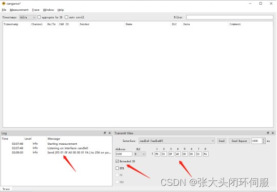

先通过 `O_Set` 或 `93 88` 命令记录零点。触发回零后，电机选择最短路径回到该单圈位置。

#### 单圈方向回零

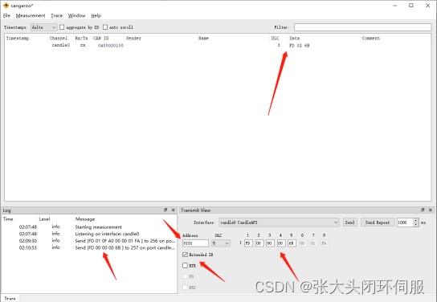

方向回零按照 `O_Dir` 指定方向寻找已记录的单圈零点。

### 7.2 多圈无限位碰撞回零

其原理是利用机械结构碰撞时“转速下降、电流上升”的特征判断零点。三个条件必须同时满足：

```text
实际转速 < O_SL_Rpm
实际相电流 > O_SL_Ma
持续时间 > O_SL_Ms
```

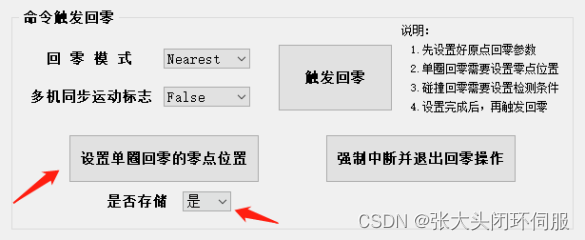

调试步骤：

1. 在固定负载下，以计划使用的回零速度正常运行。
2. 观察正常运行相电流，例如约 637 mA。
3. 将碰撞检测电流设置得略高，例如 800 mA。
4. 可先将检测转速设为 300 RPM、检测时间设为 60 ms，再根据机构调整。
5. 低速、软结构或负载变化较大时，应增大安全裕量并多次验证。
6. 可通过 `O_POT_En` 启用上电自动回零；方向错误时修改 `O_Dir`。

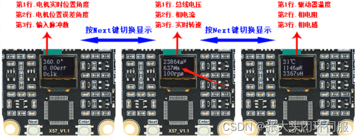

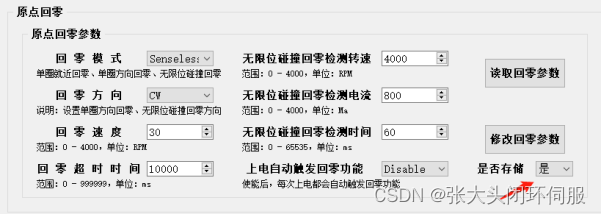

> [!warning]
> 碰撞回零会产生机械冲击，不适合易损机构、高惯量负载或夹伤风险场景。应先降低回零速度和电流，设置超时，并准备急停。

### 7.3 多圈有限位开关回零

#### 脉冲接口限位接线

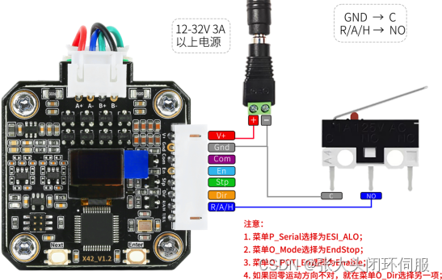

#### 通讯接口限位接线

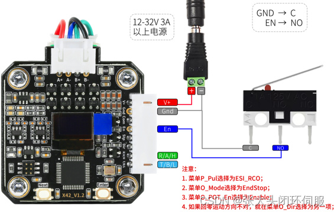

根据套餐与端口复用模式，将限位开关接入对应输入端。设置 `O_Mode=EndStop`、回零方向、速度和超时时间后再触发回零。

## 八、到位输出与报警输出

### 8.1 到位输出

设置 `P_Pul=ESI_RCO` 后，当目标位置与实时位置误差小于位置到达窗口，`Dir` 复用端输出高电平。

- `COM` 不接或接 3.3 V：输出约 3.3 V；
- `COM` 接 5 V：输出约 5 V；
- `COM` 接 24 V：输出约 24 V；
- 该方式只适用于原文注明的非光耦隔离套餐。

通讯控制可通过 `Response` 选择到位返回帧：

```text
地址 FD 9F 校验
```

### 8.2 报警输出

设置 `P_Serial=ESI_ALO` 后：

- `R/A/H` 复用为限位或复位输入；
- `T/B/L` 复用为报警输出；
- 触发堵转保护或欠压等状态时输出报警；
- 将 `R/A/H` 拉至 GND 可用于复位堵转保护。

## 九、常见问题与注意事项

### 9.1 常见问题

| 提示 | 说明与处理 |
|---|---|
| `Waiting V+ Power!` | 供电不足；检查电源、电压、极性和接线压降 |
| `Not Cal` | 尚未校准编码器；进入 `Cal` |
| `Phase AABB Error!` | 电机两相绕组接线错误 |
| `Magnet Loss! Enter..` | 未检测到径向磁铁，检查磁铁、间距和安装位置 |
| `Encoder Error! Enter..` | 磁编码器通讯异常，检查安装与器件状态 |
| `Ref Voltage Error!` | 基准电压异常，可能存在硬件故障 |
| `Bus Current Error!` | 上电瞬间总线电流过大，优先排查短路 |
| `Origin Set Done!` | 单圈零点设置成功 |
| `Origin Set Fail!` | 单圈零点设置失败，检查编码器校准状态 |
| `Going to Origin..` | 正在执行回零 |
| `Go to Origin Fail!` | 回零失败，检查零点、方向、限位、阈值和超时 |

### 9.2 使用注意事项

1. 供电前检查极性、绕组线序、磁铁安装和 PCB 固定情况。
2. 不要带电插拔电机线、通讯模块和电源。
3. 电源应有足够电流余量，并根据负载设置合理限流。
4. 调试位置模式时先降低速度、加速度和行程。
5. 多机总线必须设置不同 ID；总线两端按接口规范配置终端电阻。
6. 使用广播命令前确认所有设备均可安全执行。
7. 启用上电自动回零前先验证方向、限位逻辑与超时保护。
8. 字节级协议可能随固件版本更新；部署前读取固件/硬件版本并与原文最新修订核对。

---

## 版权与整理说明

本文档依据原作者在 CSDN 发布的《Emm_V5.0步进闭环驱动说明书Rev1.3》整理。原文采用 **CC BY-SA 4.0**：转载和改编时必须署名、提供原文链接，并以相同许可证共享。

许可证：<https://creativecommons.org/licenses/by-sa/4.0/>
